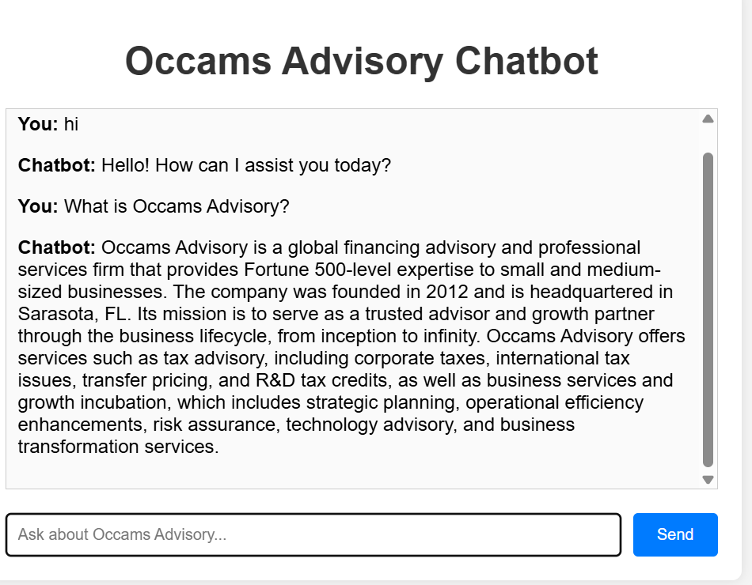

# Occams Advisory Chatbot

A Node.js-based chatbot using **LangChain** and **OpenAI's GPT** model to answer queries about Occams Advisory, strictly based on information from [https://www.occamsadvisory.com/](https://www.occamsadvisory.com/). Includes a basic UI for demo purposes.

---

## 📋 Prerequisites

- Node.js (v18.17.1 or higher)
- Visual Studio Code
- OpenAI API key (for ChatOpenAI integration)

---

## ⚙️ Setup Instructions

### 1. Clone the Repository (if applicable)
```bash
git clone <repository-url>
cd occams-chatbot


---


### ✅ Install Node.js Dependencies

```bash
npm install

### ✅ Configure Environment

1. Create a `.env` file in the project root.  
2. Add your OpenAI API key:

```env
OPENAI_API_KEY=your_openai_api_key_here

### ✅ Run the Application

```bash
node src/server.js

##UI

